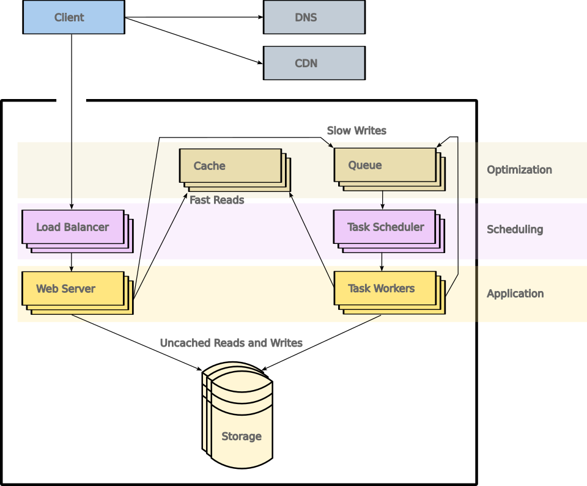

# A basic template for application architecture

## Purpose

This repo contains diagrams that I use when discussing distributed
systems architecture.

## Basic component categories

While every application's architecture will be unique, some elements
of system architecture are common enough to be taken for granted.
Those elements can be treated as a template from which to start when
discussing the architecture of new systems.

Several categories of components are common in distributed systems.
These include controllers, synchronous workers, asynchronous workers,
cache for expensive reads or calculations, queue for work that can be
done out of band, and persistent storage.

The basic structure might look like this:

  
   

## Structuring synchronous request handlers

For many, if not most services, those general elements will not be
homogeneous.  For example, the front-end systems that directly handle
incoming requests might not be a deployment of a single application.
Instead, the front-end systems may be a collection of microservices.

While microservice architectures generally come at a cost of increased
request latency, they offer a number of advantages in return.
Microservices allow individual components to scale independently,
which also means that limits can be placed on each microservice
independently to control costs according to the value of the
microservice.  Microservices provide better isolation for each service
to the team responsible for them, which can make incident handling
easier.  Microservices also allow security controls to be scoped more
narrowly, to ensure that data access is strictly limited to the code
that needs access to the data.

  
   

## Structuring asynchronous work handlers

Simple work handlers might simply be homogeneous workers that directly
interface with the queue, while the asynchronous workers in more
complex systems will have a structure very similar to the general
structure of the overall service.  These might have dedicated
schedulers to implement task prioritization and job dependencies.
Workers may have their own cache system, and might queue new tasks
upon completion of some types of work.

## Structuring persistent data storage

Persistent data may also be more complex than the general architecture
diagram suggests.  A service might mix SQL storage for structured data
with object storage for unstructured or document data storage.  It's
also common to scale out SQL storage with a small set of nodes that
handle transactions (to reduce locking costs during a transaction),
and a larger set of read-only replicas.  When SQL storage consists of
distinct read replicas and write replicas, the application might use
separate connection pools for each set, or it might rely on an
intelligent load balancer capable of transparently routing requests to
the correct set.

  
   

## Multi-site scaling

Deploying the application in multiple regions can improve both
performance and availability.  Customers may benefit from a deployment
that is geographically closer due to reducing latency that is inherent
in long distance transmission, and may reduce reliance on
international network connections that may be saturated, compared to
local networks.

Multi-region deployments and multi-availability-zone deployments
within a region can serve to keep a service operating in the event of
a service disruption that affects the site where a service is
operating.

## Supporting infrastructure

Some supporting infrastructure, which is not part of the application
per se, will also be needed.  These components typically include the
build/test/deploy systems that manage rollouts of your application,
monitoring systems that can alert staff to outages and in some cases
stop a rollout if it causes error rates to rise, and backup systems to
protect your code and data.

## Data scalability

Once the basics of the architecture are in place, scalability is often
a function of reducing the cost of access to persistent data storage.
Costs may be measured in terms of request latency, or in the more
literal financial costs of operating the data storage service.

### The cache and the queue

The first step in reducing data access costs is to reduce synchronous
accesses to the data storage service.  Application logs and metrics
can be used to identify slow requests, which can be reviewed to
determine if the cache and the queue are being used appropriately.

Reads and other calculations which are slow, deterministic, and
frequent should be cached.  Slow writes should be queued, so that
expensive operations like content scanning, data format conversion,
and web hooks happen asynchronously.

### Clustering and connection pooling

Replicated database clustering offers horizontal scalability for reads
with minimal additional support in the application.

Some load balancers (e.g. pgpool II) offer statement-level load
balancing which can offer modest latency improvements by better
distributing select statements.

### Query optimization

Query optimization usually starts with the slow query log.  Generally,
developers will enable slow query logging and examine the log to
identify queries that tend to appear frequently.  Common causes of
slow queries include filtering or joining on columns that are not
indexed appropriately, or very large table joins masked by "select
distinct".  Slow queries may need to be rewritten, or indexes may be
needed.  Developers can continue to decrease the slow query threshold
and repeat.

### Front-end/application tier sharding

In many cases, front-end sharding can be done without modifications to
the application.

Generally, such a configuration will have some number of load
balancers which are configured to shard one or more areas of the
application by an element of the request, such that requests that will
generate identical SQL queries are sent to the same cluster of
application servers.

Behind the load balancers are application server shards, consisting of
some number of HTTP servers backing the service, and a shared cache.
The size and performance of the cache server is critical to
determining the optimal number of shards.  If there are too few
shards, data will overflow the cache, resulting in too many queries
falling through to the SQL servers.

### Back-end/data tier sharding

Back-end sharding can improve performance further by reducing the size
of tables and indexes, but may require extensive refactoring of the
application layer if the backend does not support transparent
sharding.  Further, models may not be able to rely on foreign keys for
SQL data consistency.

### Cache or Pre-render data

Because the scalability of your service is in part a function of the
scalability of your application, your service may be more scalable if
requests can be answered without reaching your application.

If there are requests whose responses will be identical for all users,
the edge tier may include reverse caching servers that return static
responses.

Taking this approach a step further, in some cases it will make sense
to proactively render content as static data.  Serving static data
scales very well, and can dramatically reduce the number of requests
that need to be handled by your application and its storage back-end.
In some cases, serving static content may also make it easier to
manage cache invalidation and incremental updates of data.

### Denormalize data

For some types of services where dynamic content is strictly required,
and where all other approaches fail to achieve the desired
performance, it may ultimately be worth considering the use of
denormalized data in the production service.  Normalized data is ideal
for organization and consistency, but joining tables can increase query
latency, and in some cases the best solution will be to avoid joins by
denormalizing data.

In some approaches, denormalization can take the form of priming the
caching layer.  Batch processing jobs can produce a "cache" that
provides all of the queries and values that are expected for each
shard, and this approach may not require any modifications to the
application code.

In other cases, a disk-based key-value storage system may be
preferable to support more flexible lookups, scalability beyond memory
constraints, and incremental data updates.

Like back-end sharding, denormalizing data can require significant
changes to the application tier, and is usually considered when other
options have reached the limit of their scalability.

The following illustration represents an application with a management
service, where publishers manage their accounts and the data they wish
to publish, along with a publishing service used by consumers.  The
data for the management service is extracted, transformed, and loaded
(ETL) into the sharded, denormalized data store used by the publishing
service.  The resulting data is available to the publishing service in
a format that is ideal for quick, low-latency lookups.

  
   

